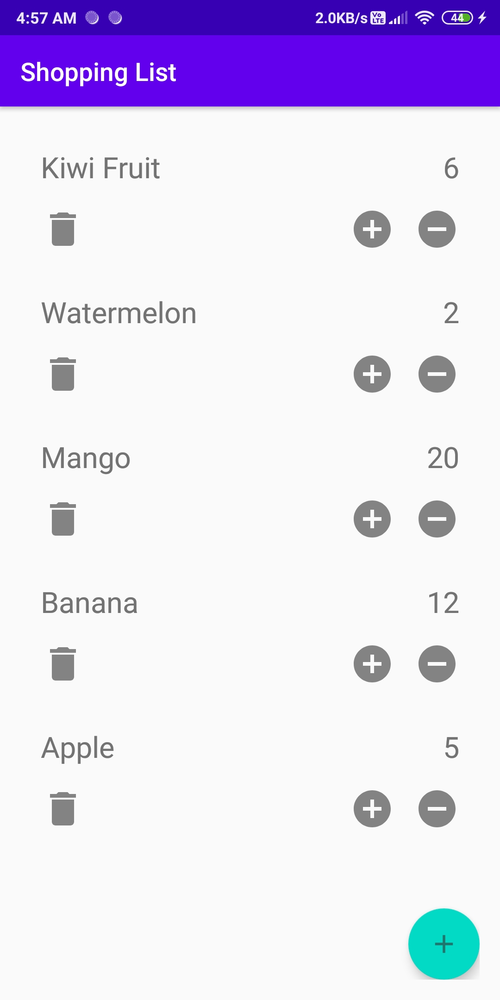
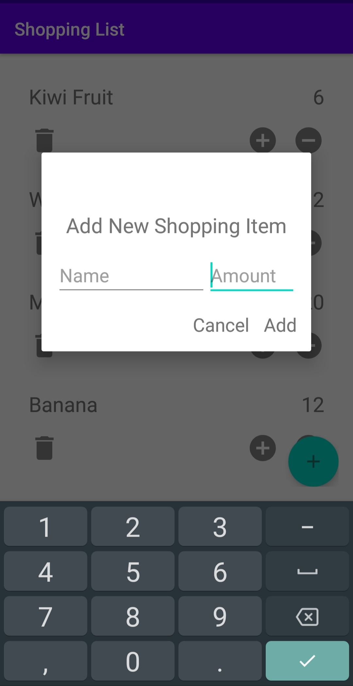

# Shopping List App

### Important Aspects-
  - MVVM Architecture
  - Room Persistence Library
  - ViewModel connected to Repository
  - Repository connected to Room DB
  - UI elements handled separately by activities(ViewModel for functionalities, Activity for UI handling)
  - Coroutines for DB handling
  - Kodein Dependency Injection
  
  
#### Activity(UI) <-->  ViewModel(LiveData) <--> Repository(Dao Methods) <--> Database(Room DB)

### Screenshots-
 
